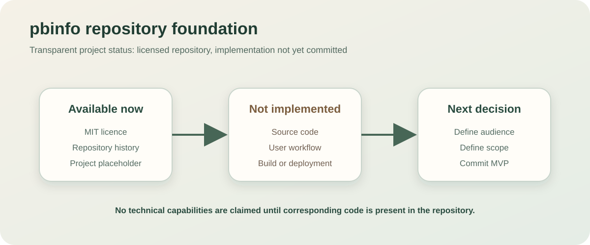
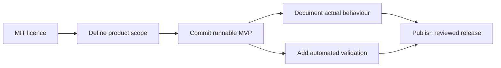

# pbinfo

**Repository reserved for a future Paradis College programming-education project.**

<p align="center">
  
</p>

<p align="center">
  
  
  
</p>

## Current status

This repository currently contains:

- an MIT licence;
- this documentation;
- no application source code;
- no user interface;
- no database or API;
- no build, run, test or deployment commands.

No technical features are claimed because there is no implementation to verify yet.

## Why the README is intentionally limited

A project README should describe software that actually exists. Inferring a product from the repository name would risk documenting features, technologies and usage that have not been implemented or approved.

The name `pbinfo` may suggest a relationship to Romanian programming-problem education, but the intended audience and product scope must be defined before technical documentation can be completed.

## Decisions required before implementation

### Product scope

Choose one explicit direction, for example:

- a curated collection of programming problems;
- a classroom progress dashboard;
- a browser interface for problem solving;
- teaching resources aligned to Romanian informatics curricula;
- an integration or companion tool for an existing problem platform;
- an internal repository for lesson plans and solved examples.

These are possible directions, not current capabilities.

### Audience

Define who the project serves:

- pupils;
- teachers;
- programming-club mentors;
- school administrators;
- competition participants;
- public visitors or internal school users.

### Data and permissions

Before collecting student work or progress, define:

- what data is stored;
- where it is hosted;
- who can view or edit it;
- retention and deletion rules;
- parental or institutional consent requirements;
- whether external platform content may be reproduced or linked.

### Technical approach

Only after the product scope is known should the repository select:

- application architecture;
- programming language and framework;
- database;
- authentication model;
- hosting platform;
- test strategy;
- deployment workflow.

## Suggested first milestone

A small and verifiable first release could contain:

1. a one-page product brief under `docs/`;
2. a clear data/content ownership policy;
3. one runnable application skeleton;
4. one representative user workflow;
5. automated checks that run in CI;
6. setup instructions tested on a clean machine;
7. screenshots generated from the actual implementation.

## Proposed repository structure

The exact structure depends on the selected stack. A neutral starting point could be:

```text
pbinfo/
├── docs/
│   ├── product-brief.md
│   ├── architecture.md
│   └── repository-status.svg
├── src/                  # Application source after stack selection
├── tests/                # Automated tests
├── .github/
│   └── workflows/        # CI configuration
├── .gitignore
├── LICENSE
└── README.md
```

Do not create empty framework directories merely to make the repository appear more complete. Add them when the corresponding implementation begins.

## Documentation checklist for the first implementation

Once code is committed, replace the foundation-only sections with evidence-backed documentation:

```text
[ ] What problem the application solves
[ ] Intended users
[ ] Screenshots of the current interface
[ ] Architecture and data-flow diagram
[ ] Exact prerequisites
[ ] Installation commands
[ ] Configuration and environment variables
[ ] Database setup and migrations
[ ] Development run command
[ ] Test command
[ ] Production build and deployment
[ ] Example user workflow
[ ] Known limitations
[ ] Privacy and security notes
[ ] Contribution process
[ ] Licence and content provenance
```

## Suggested contribution workflow

Until an application architecture is selected, contributions should focus on product definition rather than speculative scaffolding.

```bash
git checkout main
git pull
git checkout -b docs/define-project-scope
```

A scope-definition pull request should answer:

- What is being built?
- Who will use it?
- What is deliberately outside the first release?
- What existing systems or content sources does it depend on?
- What privacy constraints apply?
- How will success be evaluated?

## Privacy and educational-data warning

A future school-facing application may handle minors’ data, educational records or identifiable submissions. Do not commit or expose:

- student names linked to performance data;
- private email addresses;
- classroom credentials;
- access tokens;
- copied assessment data without permission;
- third-party copyrighted problem statements without a valid basis.

Privacy requirements should influence the architecture from the first real implementation, not be added after deployment.

## Repository state diagram



## Licence

The repository is licensed under the MIT License. Future source code committed here will fall under that licence unless explicitly documented otherwise. Educational content and third-party assets may require separate attribution or permissions even when the application code is MIT-licensed.
